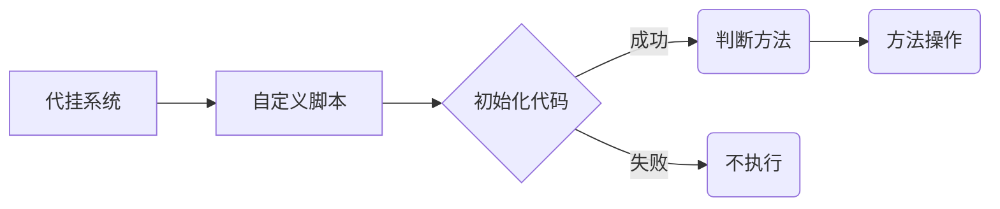
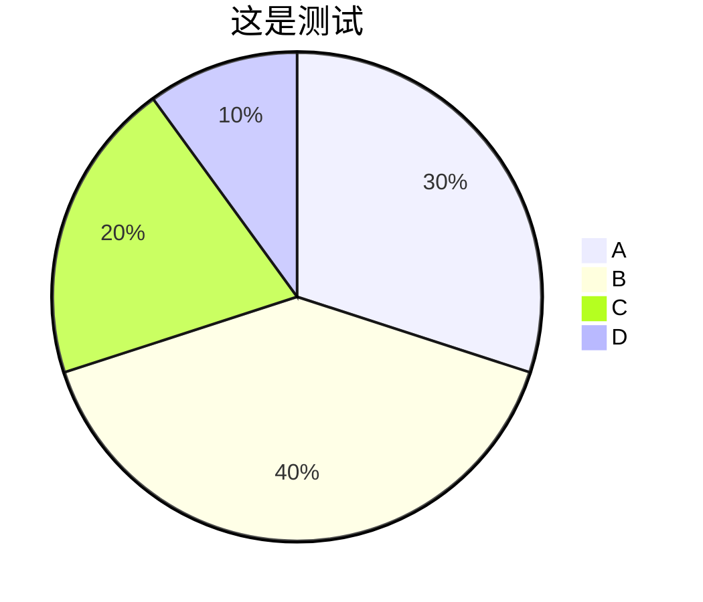

### 代挂机器人 自定脚本 仓库 

编写各种脚本

```mermaid
graph LR
    A[代挂系统] --> B[自定义脚本]
    B --> C{初始化代码}
    C --> |成功|D
    C --> |失败|E
    D(判断方法) --> F(执行方法)
    E(不执行)
    F(方法操作)
```

图形化测试

```mermaid
pie
    title 这是测试
    "A" : 30
    "B" : 40
    "C" : 20
    "D" : 10
```